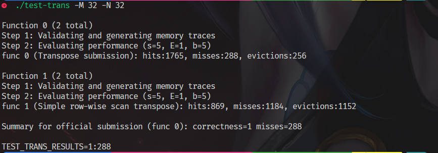
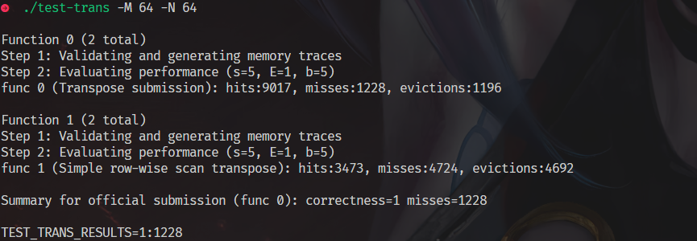
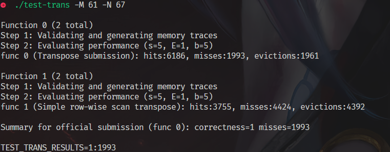
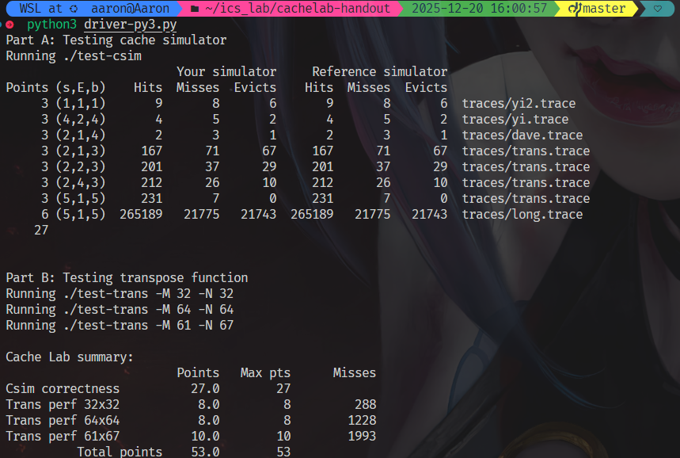

# part A 思路
## LRU实现：
cache的每一行 额外存储一份 **时间戳**：
    进入时候初始化为0
    每次有进入缓存，都扫描，将所有 valid 的行 时间戳都++
    （工程细节：为了减少判断次数，进入时候先把 set 所有valid 时间戳普遍++，再把自身时间戳置零）
    查询的时候，寻找当前 set 最大的时间戳对应的行地址
    （可能的优化： 在进入的时候动态维护每个set的LRU 地址，进入额外开销为1；如果每次搜索，每个行经过 e次就会出去，均摊下来好像常数级别优化）

## 命中情况判断
    遍历，找到了则 hit ； 否则 miss
    miss 时候如果set 还有空的行则是冷不命中，放入即可
    若已经没有 valid = 0 的行，则容量未命中， 需要eviction

## 命令行参数
    主程序读取

## 结果截图


# part B 思路
## 优化点分析
1. 写入B的时候可能驱逐A所在块

避免冲突不命中
地址最低5位是B，读取A后续行的时候：经过8个行，走了8 * 32 * 4 = 2 ^ 10 字节
也就是走了16行之后，第17行的S和B完全一样，只有标记位不一样
这个时候会覆盖B里面 因为写入产生的缓存
因为我们是写回加写分配
那每次取出B[j][i]尽量把第j行的这个块都写完再写回比较好


2. B写入不局部
对于暴力转置,问题在于写入的局部性
对于目标矩阵，同一列不断写入需要在内存中不连续跳跃，就会不命中
也就是想办法让写入的矩阵也是同一行连续写，但是最好又不要破坏按照行读入的读局部性

缓存是32组，每组1行 8个int 
那么8 * 8 分块的话，就不会溢出

```
结果：
Function 0 (2 total)
Step 1: Validating and generating memory traces
Step 2: Evaluating performance (s=5, E=1, b=5)
func 0 (Transpose submission): hits:1709, misses:344, evictions:312

Function 1 (2 total)
Step 1: Validating and generating memory traces
Step 2: Evaluating performance (s=5, E=1, b=5)
func 1 (Simple row-wise scan transpose): hits:869, misses:1184, evictions:1152

Summary for official submission (func 0): correctness=1 misses=344
```

3. 对角线上的块还是会 A B之间冲突
写A[0:8][0:8] 和 B上的相同位置 还是会冲突？只是猜测，不能确定实际上两个数组的间隔
用本地局部变量（寄存器） 存储A上的每行8个，这样的话A被驱逐不影响我们继续正常从寄存器写入B

## 结果1


## 64 * 64
1.  同理，缓存适应于一次8个int
我们考虑分到8 * 8 的矩阵
和之前的区别是，A B 里每过4 行 就会遇到 S 和B 完全一样的会冲突的块
所以实际上需要是4 * 4 的小矩阵才不会自我驱逐
所以对8 * 8 的矩阵再次分4小块处理
8*8 分块针对转置内容 防止B驱逐A
对于每组块我们则是防止B的写冲突的高效转置
第一步，将A的左上和右上一次性复制给B
第二步，用本地变量把B的右上角存储下来
第三步，将A的左下复制给B的右上
第四步，利用上述存储B的右上角的本地变量，把A的右上复制给B的左下
第五步，把A的右下复制给B的右下
## 结果2


## 61 * 67
基础尝试 普通分块16 * 16 ， 已经足够性能




# 参考文献：
https://zhuanlan.zhihu.com/p/484657229 - 有的地方实在想不通或者想不到有所参考，但是所有思路都是学习会了自己打一遍的

# driver 统一测试报告
