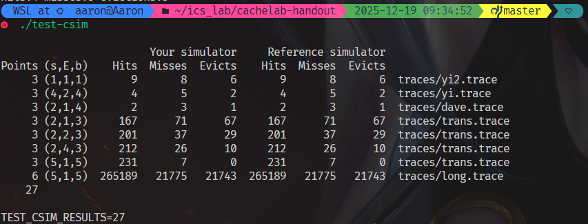

# part A 思路
## LRU实现：
cache的每一行 额外存储一份 **时间戳**：
    进入时候初始化为0
    每次有进入缓存，都扫描，将所有 valid 的行 时间戳都++
    （工程细节：为了减少判断次数，进入时候先把 set 所有valid 时间戳普遍++，再把自身时间戳置零）
    查询的时候，寻找当前 set 最大的时间戳对应的行地址
    （可能的优化： 在进入的时候动态维护每个set的LRU 地址，进入额外开销为1；如果每次搜索，每个行经过 e次就会出去，均摊下来好像常数级别优化）

## 命中情况判断
    遍历，找到了则 hit ； 否则 miss
    miss 时候如果set 还有空的行则是冷不命中，放入即可
    若已经没有 valid = 0 的行，则容量未命中， 需要eviction

## 命令行参数
    主程序读取

## 结果截图

# part B 思路
## 优化点分析
1. 写入B的时候可能驱逐A所在块

避免冲突不命中
地址最低5位是B，读取A后续行的时候：经过8个行，走了8 * 32 * 4 = 2 ^ 10 字节
也就是走了16行之后，第17行的S和B完全一样，只有标记位不一样
这个时候会覆盖B里面 因为写入产生的缓存
因为我们是写回加写分配
那每次取出B[j][i]尽量把第j行的这个块都写完再写回比较好

2. B写入不局部
对于暴力转置,问题在于写入的局部性
对于目标矩阵，同一列不断写入需要在内存中不连续跳跃，就会不命中
也就是想办法让写入的矩阵也是同一行连续写，但是最好又不要破坏按照行读入的读局部性

缓存是32组，每组1行 8个int 
那么8 * 8 分块的话，就不会溢出

3. 对角线上的块还是会 A B之间冲突
写A[0:8][0:8] 和 B上的相同位置 还是会冲突？只是猜测，不能确定实际上两个数组的间隔